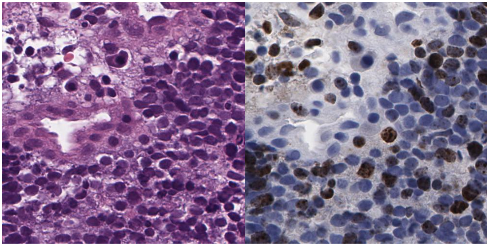

# Re-stained whole slide image registration

This is a repo about whole slide image(WSI) registration for re-stained slides.   
In clinical practice, we occasionally use different chemicals (such as H&E and IHC) to stain and re-stain to identify particular cells in the same tissue.
To enable cell level analysis, WSIs should be aligned. However, traditional method (such as SIFT[1], ECC[2] and FFT[3]) may fail due to the drastic discrepancy in two WSIs,as shown in below. 
   

Our method provide a way to integrate these methods into a simple but effective workflow, and help these methods perform robustly. If you find this repo helpful to your project, please cite the paper below:

    -- Robust Hierarchical Density Estimation and Regression for Re-stained Whole Slide Image Co-registration

#### Description of directories  
1. tools: WSI matching tools for manually registration and validation   
2. src: implementation of method presented in the paper, you can have more details in the readme.md in this folder. You can:  
    * go though the workflow step by step;   
    * also refer to an end-to-end solution for multiple pairs of WSIs by just modifying the data path in run_all.py and run.  
    Basically, you just need to call match_WSI(HE_Img_name, IHC_Img_name, methods, save_to) in your project. The first
     two parameters are the file names of the fixed and the float WSIs; parameter "methods" can be one/all of the method(s) mentioned in
     our paper; parameter 'save_to' defines where to save your result, your results will be saved as csv files in the folder you pointed to.   
3. data: data for replicating the figures in the paper.   
    Because each WSI takes up more than 4GB, we are not able to upload the original WSIs for demonstration. Some intermediate data in our experiments are provided to replicate our results.

#### Reference
1. Lowe, David G. "Object recognition from local scale-invariant features." In iccv, vol. 99, no. 2, pp. 1150-1157. 1999.
2. Kim, Jeongtae, and Jeffrey A. Fessler. "Intensity-based image registration using robust correlation coefficients." IEEE transactions on medical imaging 23, no. 11 (2004): 1430-1444.
3. Reddy, B. Srinivasa, and Biswanath N. Chatterji. "An FFT-based technique for translation, rotation, and scale-invariant image registration." IEEE transactions on image processing 5, no. 8 (1996): 1266-1271.

